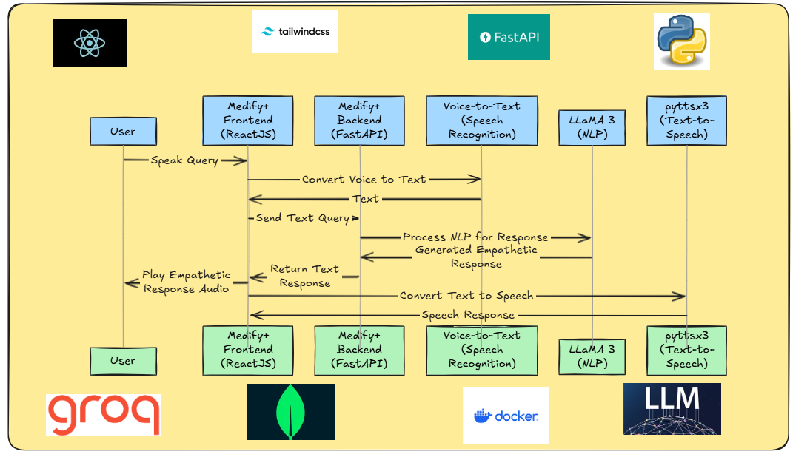
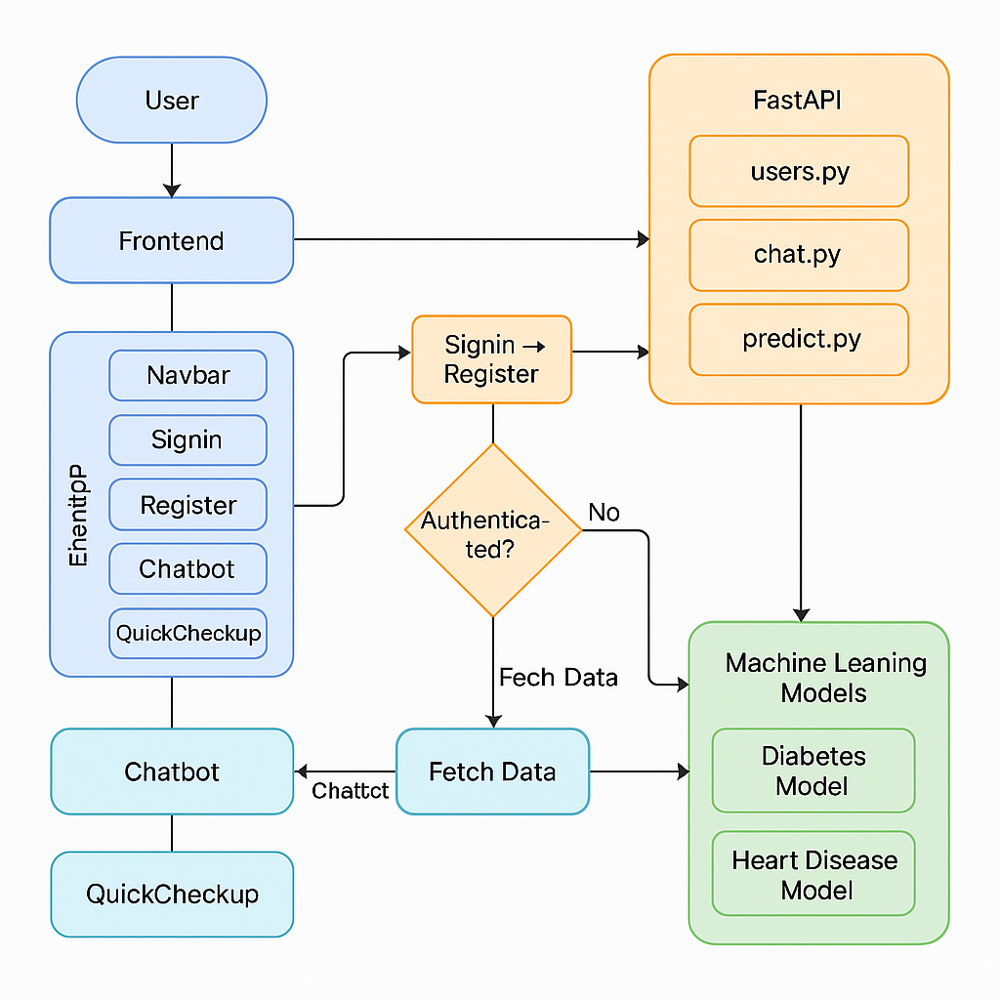

# 🚑 Medify+ – Your AI-Powered Health Assistant

Medify+ is an AI-driven health assistant designed to provide **early disease detection**, **emergency support**, and **quick health checkups** using machine learning, voice input, and image analysis.

---

## 📌 Table of Contents
- [Introduction](#introduction)
- [Features](#features)
- [Tech Stack](#tech-stack)
- [Setup Instructions](#setup-instructions)
- [How to Use](#how-to-use)
- [Architecture](#architecture)
- [Demo Video](#demo-video)
- [Team](#team)
- [License](#license)

---

## 🔍 Introduction

🌟 Medify+: Your Path to Complete Wellness 🌟

At Medify+, we're not just building another healthcare app—we're creating a lifeline that seamlessly connects patients with quality care when they need it most. Our platform bridges critical gaps in the healthcare ecosystem, empowering users with an integrated solution for appointments, medical records, emergency services, and personalized health management—all in one elegant interface. By combining cutting-edge technology with compassionate design, we're transforming how healthcare is accessed and experienced, making quality medical care a right, not a privilege.

Built for HACK4BENGAL under the theme **"Healthcare Accessibility through Technology."**

---

## ✨ Features

- 🧠 **AI-Powered Diagnosis** – Predicts diseases based on user input and images  
- 🎤 **Voice-enabled Chatbot** – Converses and provides suggestions using natural speech  
- 🖼️ **Image-based Analysis** – Upload photos for condition analysis in chatbot  
- 📍 **Emergency SOS** – Sends alerts to local authorities with location information  
- 🔐 **Authentication** – Secure login and protection of health data  
- 🗂️ **Smart Health Records** – Automatically stores and updates user medical history for future reference  
- 🩺 **Appointment Scheduling** – Book and manage doctor appointments directly through the app  
- 📊 **Health Dashboards** – Visualize health trends over time with graphs and personalized insights  
- 📍 **Nearby Hospitals & Pharmacies** – Integrated maps to locate and navigate to nearby health services  
- 💊 **Medicine Reminders** – Notifies users when it’s time to take or refill medications  
- 🧬 **Multi-disease Prediction** – Supports multiple disease checks like diabetes, heart conditions, skin diseases, etc.  
- 🔁 **Real-time Chat Updates** – Keeps chatbot conversation active with real-time typing indicators and status  
- 🧾 **Report Generation** – Downloadable PDF reports of predictions and consultations  
- 👨‍⚕️ **Doctor/Admin Panel** – Doctors can view patient data, reports, and chat logs with role-based access  
- 🌐 **Multilingual Support** – Chatbot and interface support multiple languages for accessibility  
- ☁️ **Cloud Integration** – Stores user data and reports securely for access anytime, anywhere  
- 📱 **Mobile-First Design** – Fully responsive and optimized for mobile devices   
- 🛡️ **Role-Based Access Control (RBAC)** – Ensures different permissions for patients, doctors, and admins  
  

---

## 🛠️ Tech Stack

### 🔹 Frontend
- **React** – Frontend framework
- **TailwindCSS** – Utility-first CSS framework
- **Axios** – For API calls
- **Web Speech API** – For voice input and output

### 🔹 Backend
- **FastAPI** – Python framework for building APIs
- **LLM** - llama 3(Large Language Model Meta AI 3) via groq Api
- **Python ML & DL Models** – pyttsx3, gtts(alternative of pyttsx3), Speech-Recognition, Using libraries like scikit-learn, TensorFlow for predictions
- **MongoDB** – Database for storing user data
- **JWT** – JSON Web Tokens for authentication and session management

### 🔹 Machine Learning Models
- **Diabetes Prediction Models** – Diabetes prediction (sklearn models) using SVM Classifier
- **Heart Disease Detection** – Using RandomForest algorithm

### 🔹 Deployment
- **Frontend**: [view🔗](https://medify-three-opal.vercel.app/)
- **Backend**: [view🔗](https://arogyamarg-hack4bengal-25.onrender.com/)




---
### 🎥 YOUTUBE LINK FOR THE DEMO VIDEO : 
**Link** : https://youtu.be/XdB_yz5TlMo?si=hyWa4pAvceKShSD2
---

## 🧰 Setup Instructions

### 🔗 Clone the Repo

```bash
git clone https://github.com/rishovchakraborty/Medify.git
cd medify
```
⚙️ Backend Setup
1. Go to the backend folder:
```bash
cd backend
```
2. Install dependencies:
```bash
pip install -r requirements.txt
```
3. Set up environment variables.
```bash
MONGODB_URI=your_mongo_uri
MONGODB_DB=your_mongo_collection
JWT_SECRET=your_jwt_secret
GROQ_API_KEY =your_api_key
```
4. Run the FastAPI server:
```bash
uvicorn app.main:app --reload
```
🖥️ Frontend Setup
Go to the frontend folder:

```bash
cd frontend
```
Install dependencies:

```bash
npm install
```
Start the React app:

```bash
npm run dev
```
Now, visit http://localhost:5173 to access the app.

---

### 🧪 How to Use

- **Sign Up / Login** – Register a new account or log into an existing one.

- **Quick Health Checkup** – Choose a disease (e.g., Diabetes, Heart Disease), then either fill out a form or upload an image for instant predictions.

- **Chatbot** – Talk to the voice-enabled chatbot for health tips, guidance, or to ask questions naturally.

- **SOS Button** – Tap to send an emergency alert along with your current location to nearby authorities.

- **Book Appointments with E-Prescriptions** – Schedule consultations with doctors and receive digital prescriptions after checkups.

- **Track Health Matrix** – View your health progress day by day with data visualizations, trends, and wellness stats.

- **Personalized Suggestions** – Get daily health tips and lifestyle suggestions based on your medical history and checkup results.

✅ View your health results and personalized recommendations directly in the app.

---

### 🔧 System Flow Diagram



---

### 🏗️ Layered Architecture


### 👥 Team Contributions

Name	              
SRINJAY KARFA       :	Frontend Development (React, Tailwind CSS, UI/UX Integration)

JAYDEEP SARDAR  :	Backend Development (FastAPI, LLM Integration, Database, Authentication)

SRESHTHA DUTTA AND AYOSHI BOSE     :	Machine Learning Models (Disease Prediction Models, Training, Deployment)


## 🙏 Conclusion

Medify+ is more than just a healthcare app—it's a vision for inclusive, accessible, and connected care.  

We built this with passion, precision, and purpose to address real-world healthcare challenges.  

**Thank you for reviewing our project.**  
— Team MED MORPHOSIS

---

